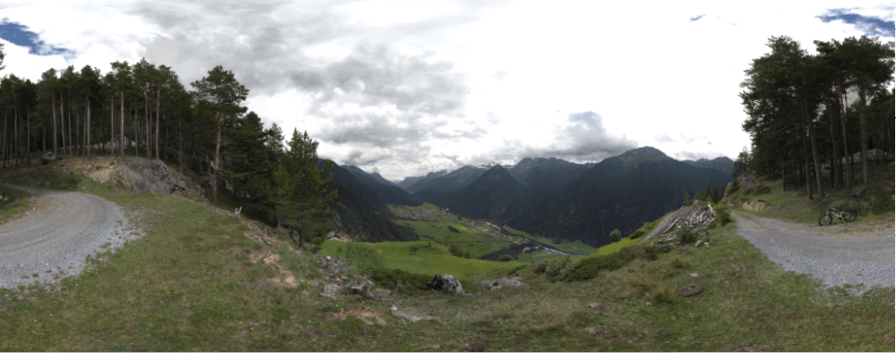
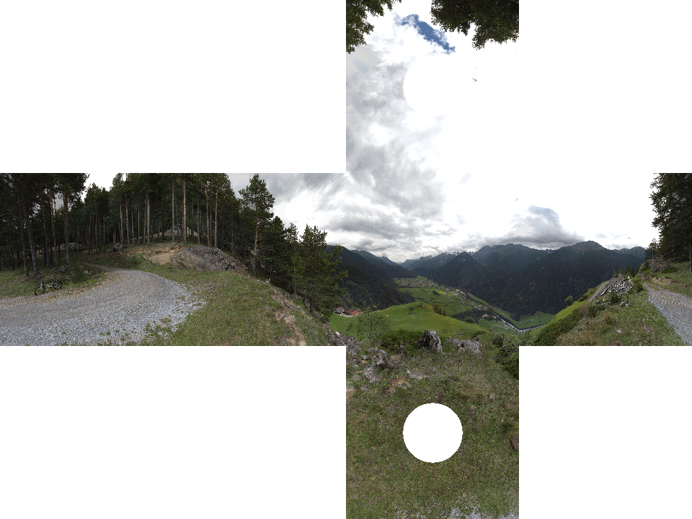

# @zebrajaeger/createpano

[](https://www.npmjs.org/package/@zebrajaeger/createpano)
[](https://packagephobia.now.sh/result?p=@zebrajaeger/createpano)
[](https://img.shields.io/github/license/zebrajaeger/sphere2cube-js)

Convert
- full spheric panorama image to viewer (equirectangular)
- 360° panorama image to viewer (y to small for equirectangular)
- partial panorama image to viewer

Reads 
- PSD and PSB with RAW or RLE Encoding
- jpg
- png

Writes
- preview (cubic)
- preview (downscaled)
- tiles (pyramide levels)
- html (pannellum implementation)
- all above as zip file 

## Installation

```bash
$ npm install -g  @zebrajaeger/createpano
```

## Usage

### Minimum

```bash
$ createpano -i sourceimage.psd
```

## Options
```bash
Usage: cli [options]

Options:
  -V, --version                              output the version number
  -i, --source <path>                        Source image (mandatory)
  -ipa, --panoAngle <degree>                 Angle of pano (default: "360")
  -ipy, --panoYOffset <degree>               Y-Offset in degree [-90.0...90.0] (default: "0")
  -o, --output <path>                        Output folder (default: "_dist")
  -te, --targetSize <pixel>                  Image edge length of a face @ max resolution (default: inputImage.x / 4)
  -fr, --facesToRender <faces>               Faces To render (default: "flrbud")
  -ti, --tilesIgnore                         Dont render tiles
  -ts, --tileSize <pixel>                    Tile size (default: "512")
  -tq, --tileJpgQuality <percent>            Jpg Image quality of tiles in percent (default: "85")
  -tp, --tilePathTemplate <template>         Tile path template (default: "{{levelCount}}/{{face}}{{y}}_{{x}}.{{fileType}}")
  -tpt, --tilePathType <type>                Tile image type (default: "jpg")
  -c, --renderCube                           Render cube sites in full resolution
  -cp, --cubePath <path>                     Cube sites path (default: "{{face}}.jpg")
  -cq, --cubeJpgQuality <percent>            Cube Jpg Image quality (default: "85")
  -pi, --previewIgnore                       Dont render preview
  -pcp, --previewCubePath <path>             Path and name of preview image (default: "preview.q.jpg")
  -pcq, --previewCubeJpgQuality <percent>    Preview quality in percent (default: "85")
  -pfp, --previewFlatPath <path>             Path and name of preview image (default: "preview.f.jpg")
  -pfo, --previewFlatOrder <path>            Face order from left to right (default: "bdflru")
  -pfq, --previewFlatJpgQuality <percent>    Preview quality in percent (default: "85")
  -psp, --previewScaledPath <path>           Path and name of preview image (default: "preview.s.jpg")
  -psf, --previewScaledFactor <path>         Factor for one Downscaling (default: "1.4142135623730951")
  -psq, --previewScaledJpgQuality <percent>  Preview quality in percent (default: "85")
  -pw, --previewWidth <pixel>                Preview width (default: "1000")
  -sp, --signaturImagePath <path>            Signature image
  -ss, --signaturSide <side>                 Signature side (default: "d")
  -sb, --signaturBelow                       Signature below pano image
  -hi, --htmlIgnore                          Don't render html
  -ht, --htmlTitle <name>                    Head-Title-Tag (default: inputImage)
  -hpp, --htmlPannellumFile <path>           Path of Pannellum .html file (default: "index.p.html")
  -hmp, --htmlMarzipanoFile <path>           Path of Marzipano .html file (default: "index.m.html")
  -zi, --zipIgnore                           Don't zip
  -zp, --zipPath <path>                      Path for Zip File (default: "pano.zip")
  -v, --verbose                              verbose
  -h, --help                                 display help for command
```

## Preview

Made here: 47.162081, 10.923371

### Downscaled



### Cubic



## TODO

- Flat image example
- Config read/write
- zip refactoring
- parse exif data (needed?)
- parse xmp (for Autopano Giga, but GoPro seems to let it die. So needed?)

## Many Thanks to

- https://stackoverflow.com/questions/29678510/convert-21-equirectangular-panorama-to-cube-map
- https://de.wikipedia.org/wiki/Alpha_Blending
- https://stackoverflow.com/questions/1726630/formatting-a-number-with-exactly-two-decimals-in-javascript
